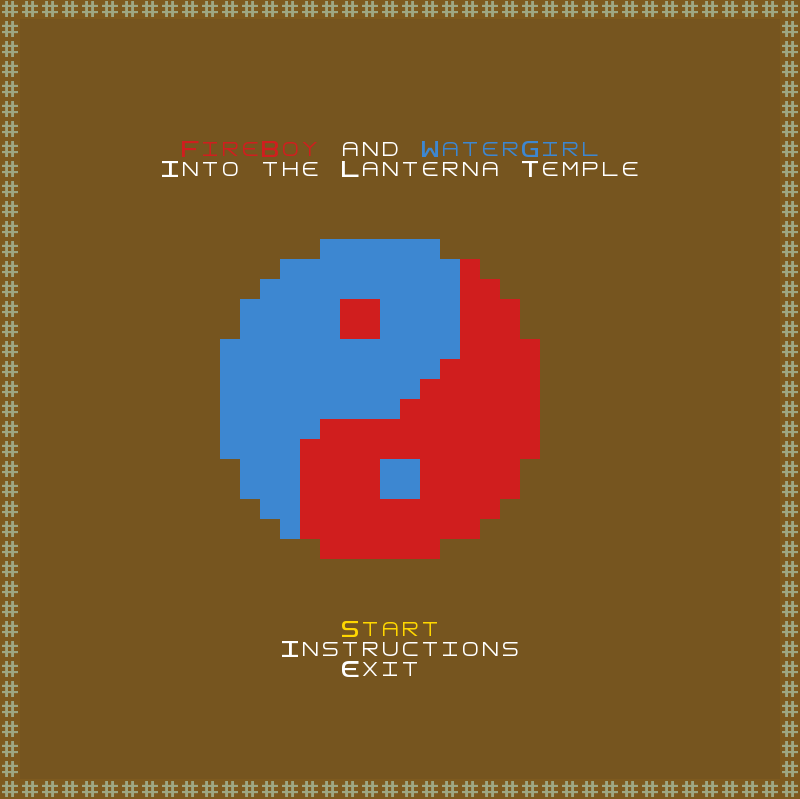
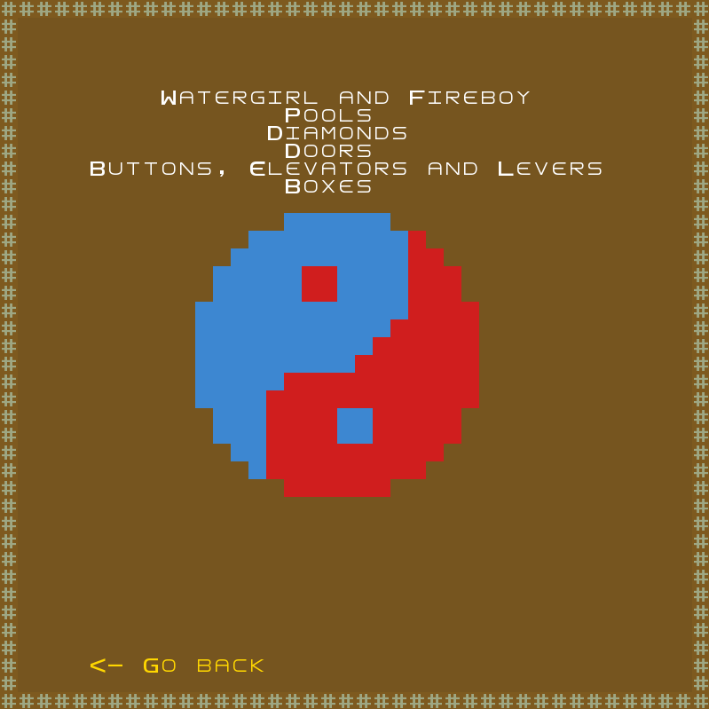
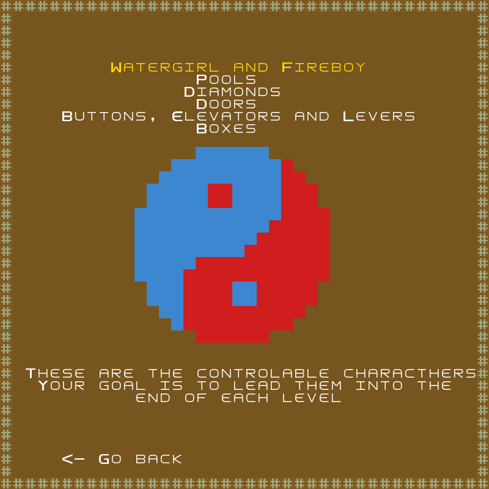
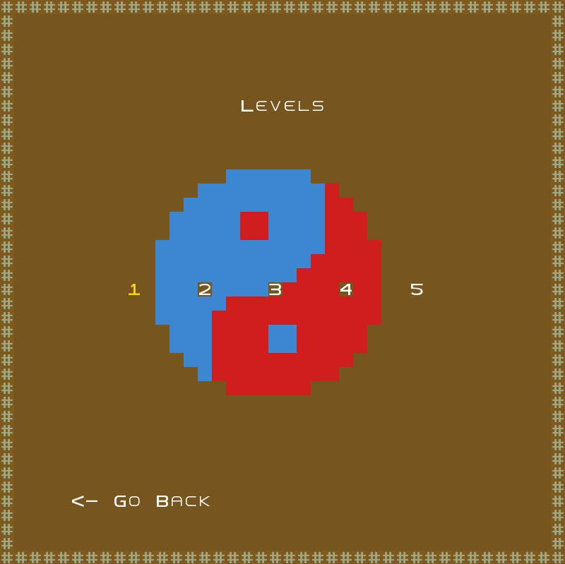
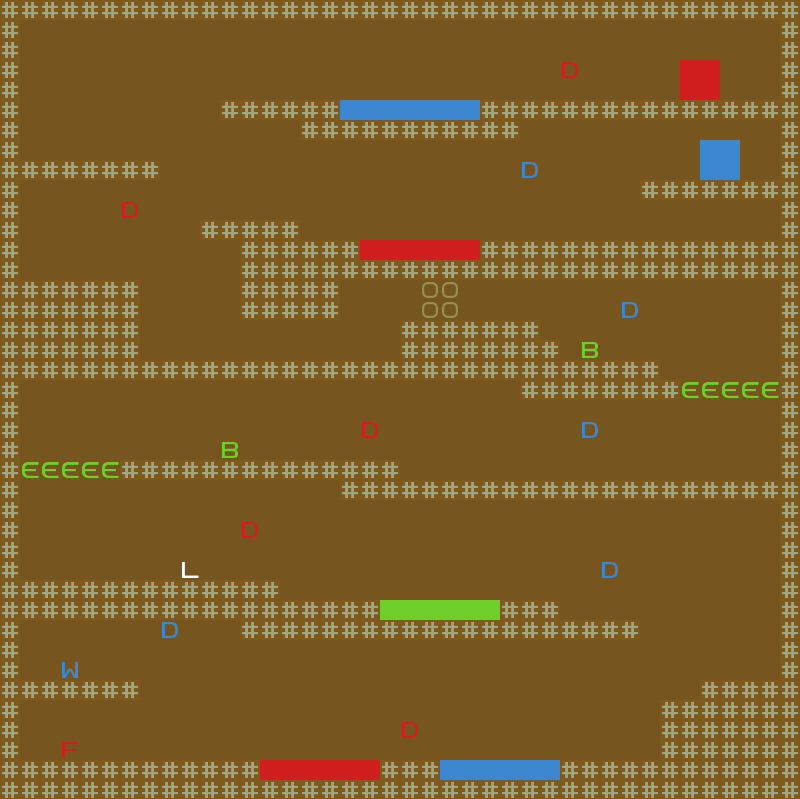
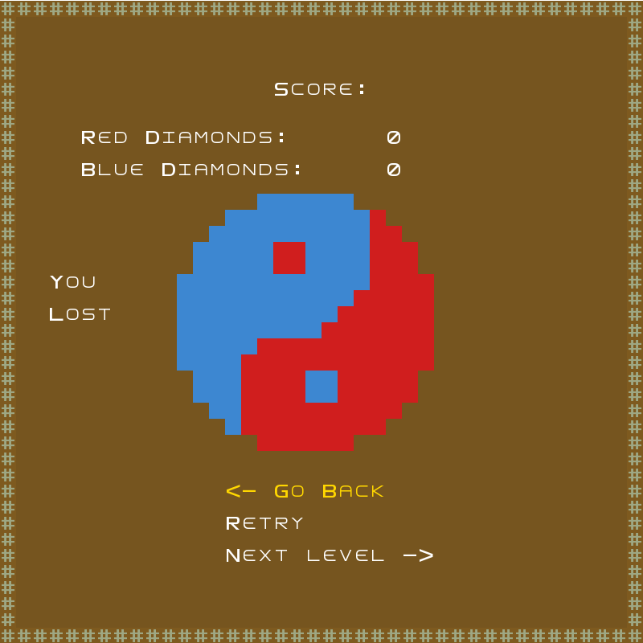

## Fireboy and Watergirl

### Game Description

Fireboy and Watergirl is a game where you can join forces with a friend and you can both try to help them get to the end of each level and catch diamonds.

This project was developed by Diogo Santos ([up202009291@edu.fe.up.pt](https://moodle.up.pt/user/view.php?id=19501&course=1518)), 
Francisco Teixeira ([up202006111@edu.fe.up.pt](https://moodle.up.pt/user/view.php?id=20924&course=1518)) and 
Tomás Silva ([up202108698@edu.fe.up.pt](https://moodle.up.pt/user/view.php?id=16261&course=1518)) for LDTS 22/23.

### Screenshots

The following screenshots illustrate the general look of our game, as well as the divergent functionalities:

- Main Menu

- Instructions Menu

- Level Menu

- Level 1

- Score Menu

## More details

For a more detailed version of this description click [here](https://github.com/FEUP-LDTS-2022/project-l12gr03/blob/main/docs/README.md).
