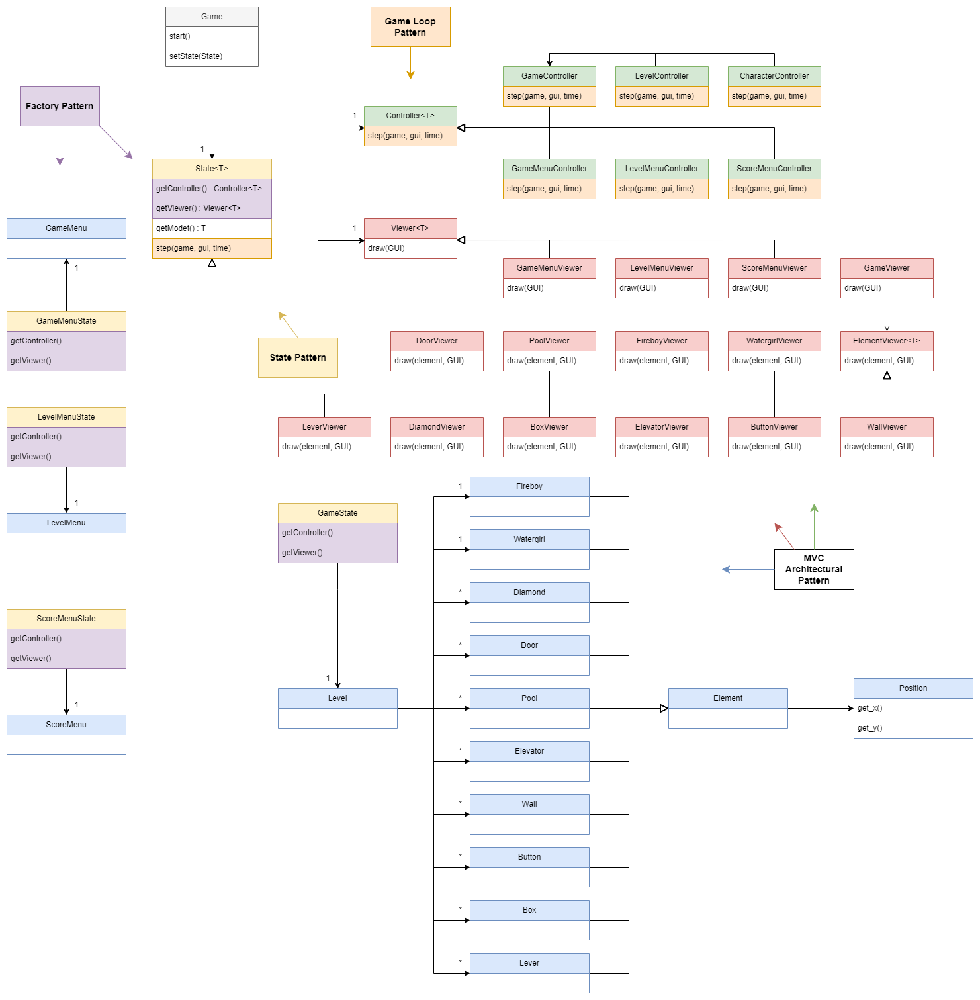
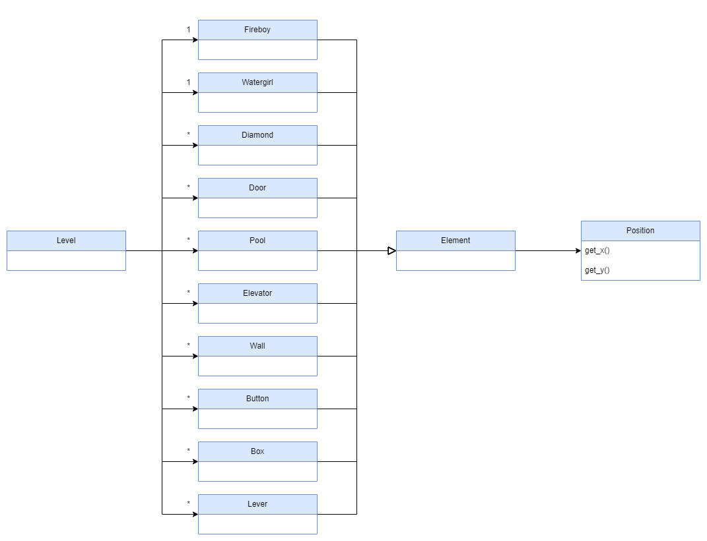
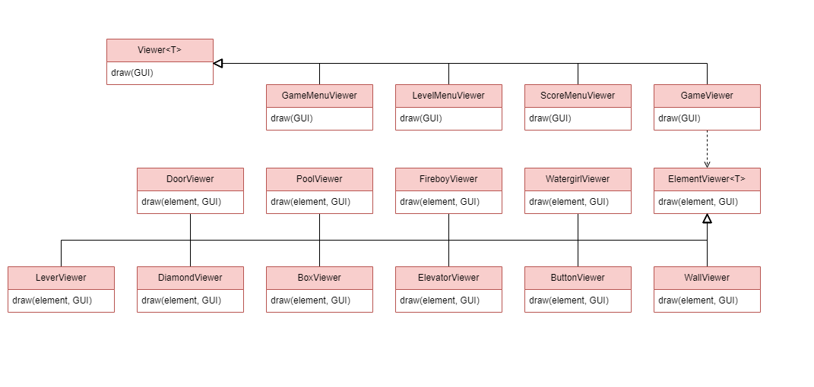
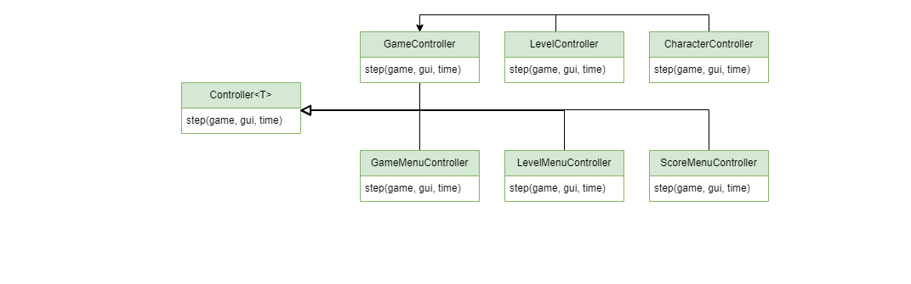
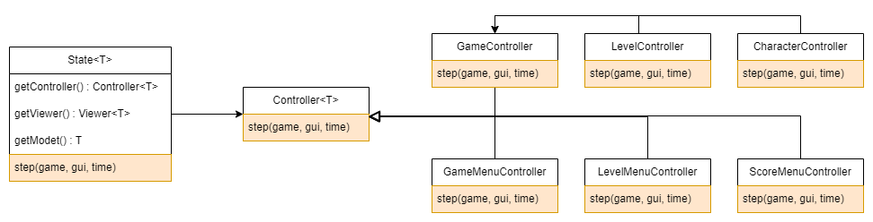
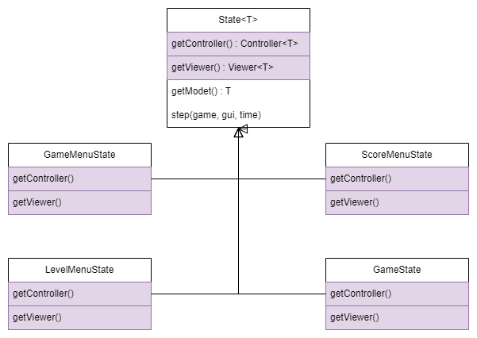
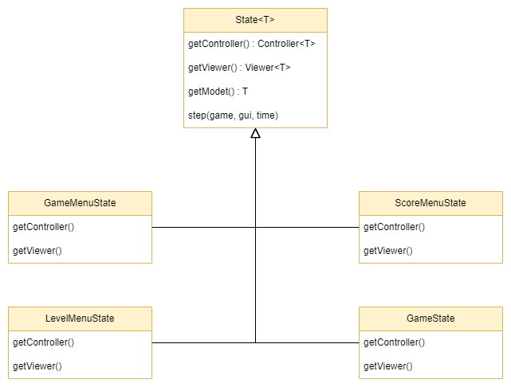
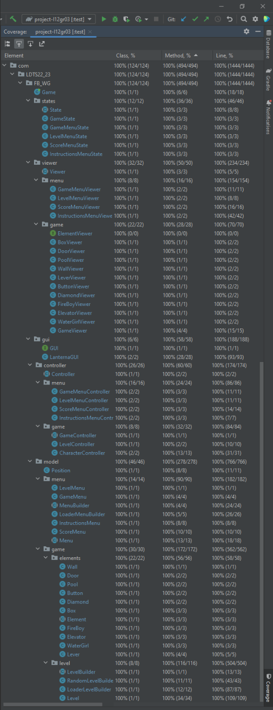

# LDTS_1203 - Fireboy and Watergirl

In this exciting game you will have to join forces with a friend and help Fireboy and Watergirl get the maximum amount of diamonds and pass each level. 
You will have 5 different levels to have fun in and improve your score each time you play.
This project was developed by Diogo Santos (up202009291@up.pt), Francisco Teixeira (up202006111@up.pt) and Tomás Silva (up202108698@up.pt) for LDTS 22/23.

## IMPLEMENTED FEATURES

- **Level 1** - The first challenge for you to surpass.
- **Instructions Menu** - This menu lightly explains the elements of our game and the controls for the characters
- **Score Menu** - Our Score Menu includes a score for each player and the option to go back to the level menu, so you can select the new level or even the option to go back again to the main menu and quit the game.
- **Pools** - Pools are an adversity for the player that he needs to surpass by jumping over them.
- **Diamonds** - Diamonds are be the players objective along with trying to get to end of each level.
- **Doors** - Doors allow the players to complete the level.
- **Boxes** - Boxes are as much an obstacle for the characters as they are a helpfull jumping platform for them.

## PLANNED FEATURES

- **Other Levels** - We currently only have Level 1 implemented. We will create the other 4 (or more) afterwards
- **Jumping** - As of now, the movement of our heroes defy gravity. That is something that will be corrected.
- **Buttons** - Buttons will be used to temporarily move elevators, so you can reach the end of each level.
- **Levers** - Levers will be used to permanently move elevators, so you can reach the end of each level.

## DESIGN

### Game Structure

**Problem in Context:**
The main problem was that we needed to control everything inside the game.

**The Pattern:**
We implemented the Model-View-Controller pattern.

**Implementation:**
Regarding the implementation, we have 3 elements:

+ Model - we have the class State that serves as bridge between the input (Controller) and the output (View).

+ View - we have the abstract class Viewer that lets us draw the output.

+ Controller - we have the abstract class Controller that receives the players input.

**Consequences:**
We have the benefit of:

+ being more efficient since the architecture of our program is divided into 3 components.
+ being more organized for the same reason as before and so it is easier to find bugs.

### Different types of commands

**Problem in Context:**
Initially, we had to designate every action every time there was an input, which would be a bad practice.

**The Pattern:**
We have applied the Game Loop pattern.

**Implementation:**
Regarding the implementation process, we used an enum to list the different possible actions and then created a method (getNextAction) that associated every enum element with an input.

**Consequences:**
This allowed us to create an action pattern for every input and evade conflicts on input.

### GUI
**Problem in Context:**
The main problem was that we needed to draw different things independently.

**The Pattern:**
We implemented the Factory pattern.

**Implementation:**
Regarding the implementation, we have an interface (GUI) that is implemented by a class (Lanterna) that imports from the Lanterna framework. This way, we were able to create an abstract class (Viewer) that lets its extended classes inherit the abstract method draw and so the screen is independent of the rest of the elements that need to be drawn.

**Consequences:**
We have the benefit of:

+ being able to use the draw method in many occasions.
+ read the player's input with the same design on the whole program.

### Changing game state
**Problem in Context:**
As the number of states of our game increased, the need to organize these different states and how they change increased as well.

**The Pattern:**
We implemented the State pattern.

**Implementation:**
Regarding the implementation, we created an abstract class (State) that is extended for all State type classes.

**Consequences:**
We have the benefit of:

+ The several states of the game become explicit in the code, instead of relying on a series of flags;
+ A well organized code acknowledging the Single Responsibility Principle;
+ Easy to add new states to the game during the development;

### KNOWN CODE SMELLS AND REFACTORING SUGGESTIONS
We currently do not possess any code smells because the more complicated functions have yet to be implemented.

### TESTING

**Coverage report**

- Here's a screenshot of the coverage report in IntelliJ. See this [link](http://localhost:63342/project-l12gr03/docs/Tests/htmlReport/index.html?_ijt=n5u3jjtishba0ebn0p78dpakr5&_ij_reload=RELOAD_ON_SAVE) for a more in detail report

**Coverage report**

**Mutation Testing**
- We could not create this test.

### SELF-EVALUATION

- Diogo Santos: 40%
- Francisco Teixeira: 30%
- Tomás Silva: 30%
